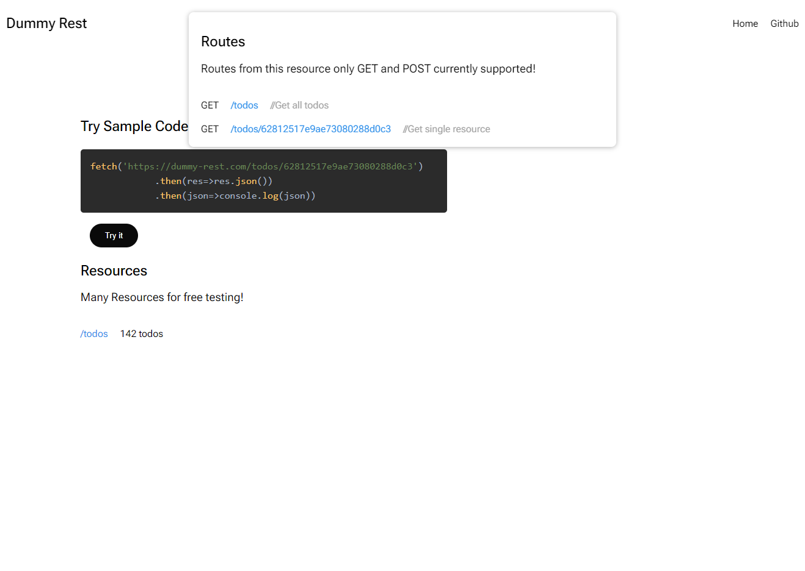

# Dummy Rest

### Overview

Dummy Rest is a service that allows you to consume json data
for testing & development purposes

client is alive at [dummy-rest.com](https://dummyrest.com)

## Features

- **Fake data** - consume fake json data for testing & development purposes

## Tech Stack

- **[Ktor](https://ktor.io/)** - framework for building rest api
- **[Reactjs](https://reactjs.org/)** - javascript library for client
- **[Mongodb](https://www.mongodb.com/)** - using mongodb as database
- **[Docker & Docker compose](https://www.docker.com/)** - for package applications into containers
- **[Nginx](https://www.nginx.com/)** - proxy server